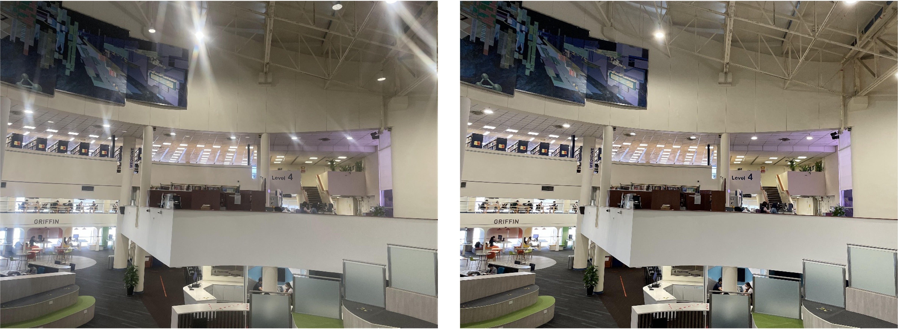
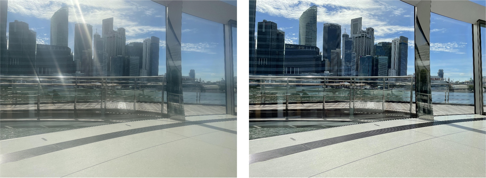
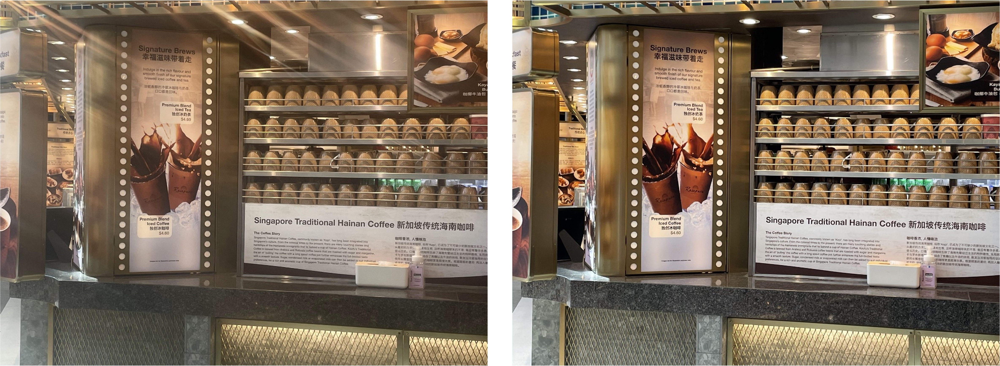

# Removing Image Artifacts From Scratched Lens Protectors
Removing Image Artifacts From Scratched Lens Protectors, ISCAS 2023

*Yufei Wang, Renjie Wan, Wenhan Yang, Bihan Wen, Lap-pui Chau, Alex C Kot*

**The first real-captured paired dataset for scratched lens protectors**

## News
[07/07/2023] The dataset is released!

## Downloading the dataset
The dataset can be downloaded at [Google Drive](https://drive.google.com/drive/folders/1jP_Mny_-Qw6qjWUdWokzyFmIHkdHJq7W?usp=sharing), where the training and testing data are provided.

The dataset is for non-commercial use only.

## Citation
If you find our work useful for your research, please cite our paper
```
@article{wang2023removing,
  title={Removing Image Artifacts From Scratched Lens Protectors},
  author={Wang, Yufei and Wan, Renjie and Yang, Wenhan and Wen, Bihan and Chau, Lap-pui and Kot, Alex C},
  journal={arXiv preprint arXiv:2302.05746},
  year={2023}
}
```

## Some samples in the dataset



